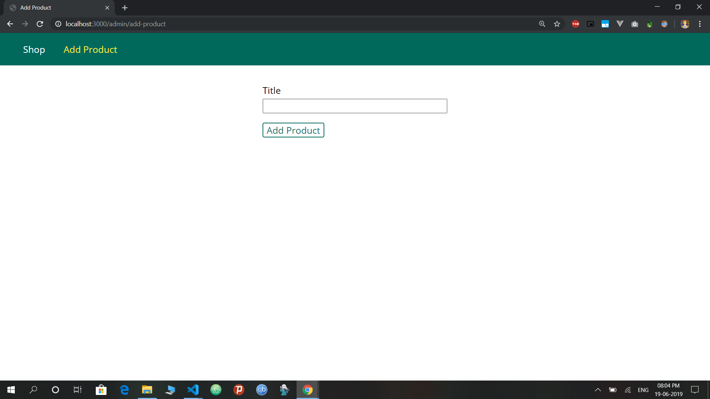
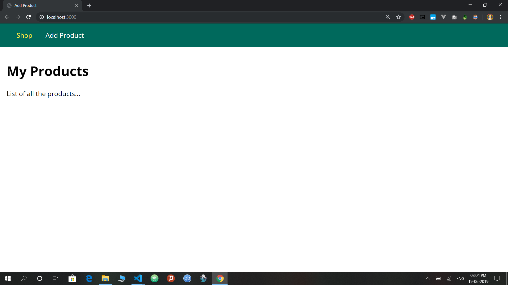

<h1 align="center">A web Store app made using ExpressJS</h1>

Made a web app using using ExpressJS. You can go to admin/add-product to add products. Then you will be redirected to home shop page.
 
This is a dummy project as data is being stored in a array list as objects. No Actual Data base is used in this project. 

## How to test the app
- Clone this repository to your local machine
- Install dependencies `npm install`
- Start the application `npm start` The magic happens on port `3000`

